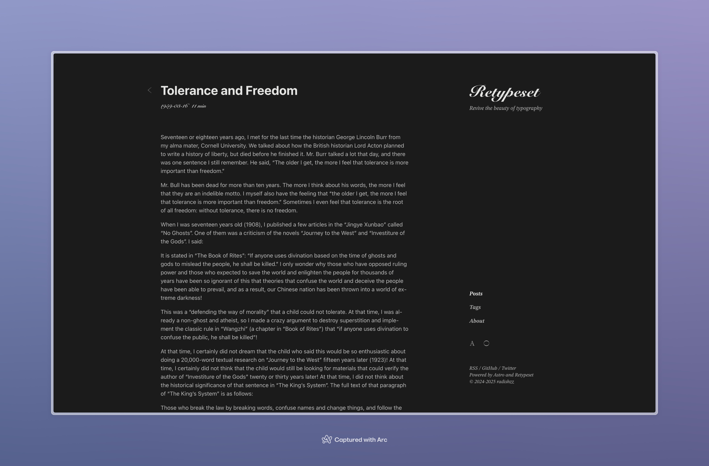

Retypeset define los esquemas de color del tema basados en el espacio de color [OKLCH](https://oklch.com/), con un esquema predeterminado de colores negro, blanco y gris que simula un estilo de impresión.

Para satisfacer las necesidades de personalización, he creado varios esquemas de colores para el tema. Puedes reemplazar el esquema de colores predeterminado en [src/config.ts](https://github.com/radishzzz/astro-theme-retypeset/blob/master/src/config.ts) y **reiniciar el servidor de desarrollo** para previsualizar el nuevo esquema de colores.

## Blanco Cebollino




```
light: {
  primary: 'oklch(0.25 0.03 211.86)',
  secondary: 'oklch(0.40 0.03 211.86)',
  background: 'oklch(0.99 0.0039 106.47)',
},
dark: {
  primary: 'oklch(0.92 0.0015 106.47)',
  secondary: 'oklch(0.79 0.0015 106.47)',
  background: 'oklch(0.24 0.0039 106.47)',
},
```

## Azul Cuervo


```
light: {
  primary: 'oklch(0.24 0.0172 280.05)',
  secondary: 'oklch(0.40 0.0172 280.05)',
  background: 'oklch(0.98 0.0172 280.05)',
},
dark: {
  primary: 'oklch(0.92 0.0172 280.05)',
  secondary: 'oklch(0.79 0.0172 280.05)',
  background: 'oklch(0.24 0.0172 280.05)',
},
```

## Azul Tinta


```
light: {
  primary: 'oklch(0.24 0.053 261.24)',
  secondary: 'oklch(0.39 0.053 261.24)',
  background: 'oklch(1 0 0)',
},
dark: {
  primary: 'oklch(0.92 0 0)',
  secondary: 'oklch(0.79 0 0)',
  background: 'oklch(0.24 0.016 265.21)',
},
```

## Beige


```
light: {
  primary: 'oklch(0.25 0 0)',
  secondary: 'oklch(0.41 0 0)',
  background: 'oklch(0.95 0.0237 59.39)',
},
dark: {
  primary: 'oklch(0.93 0.019 59.39)',
  secondary: 'oklch(0.80 0.017 59.39)',
  background: 'oklch(0.23 0 0)',
},
```
