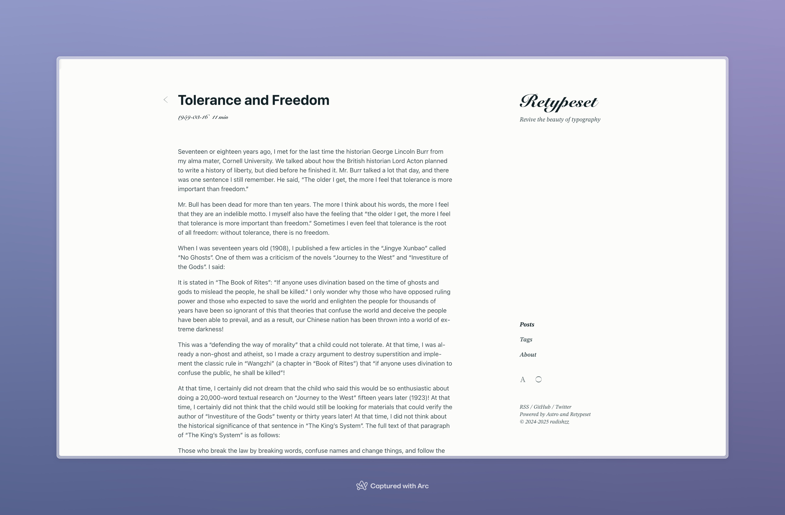
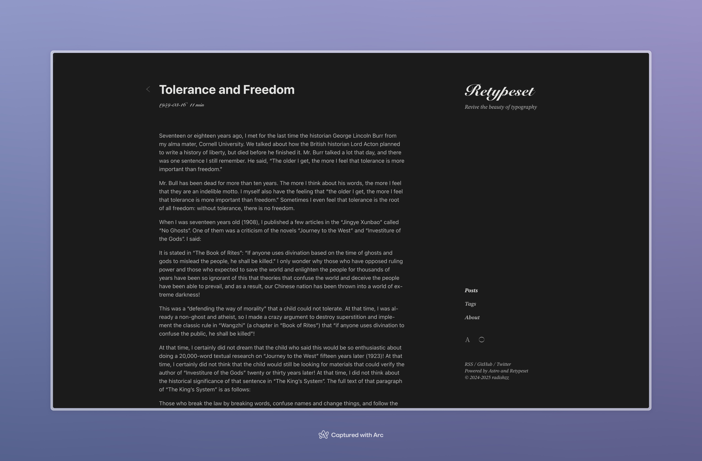
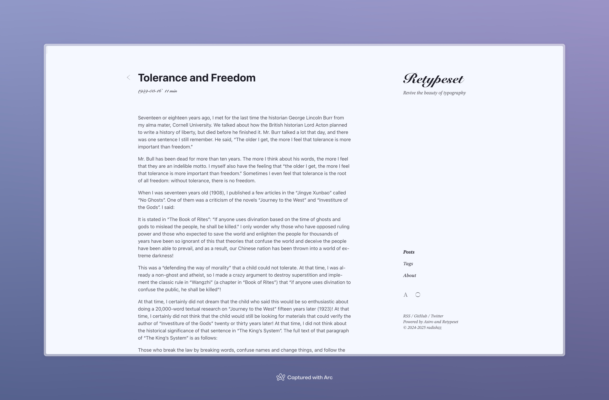
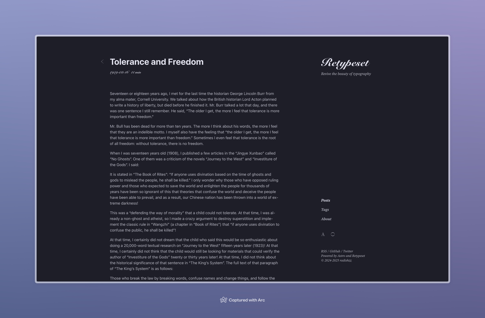
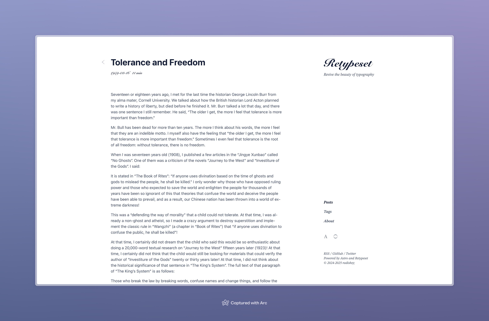
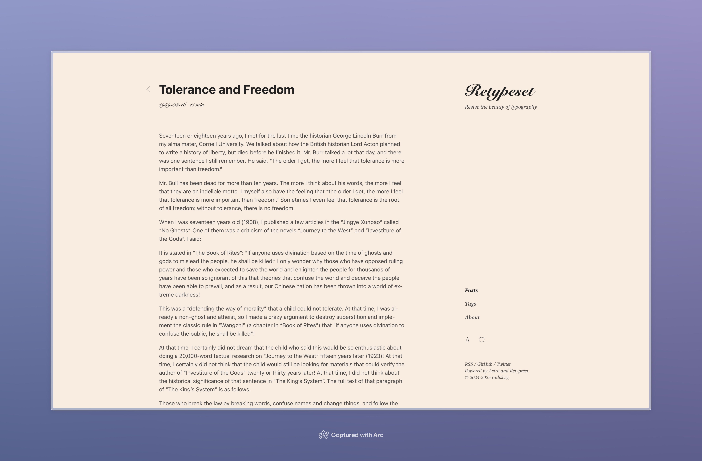
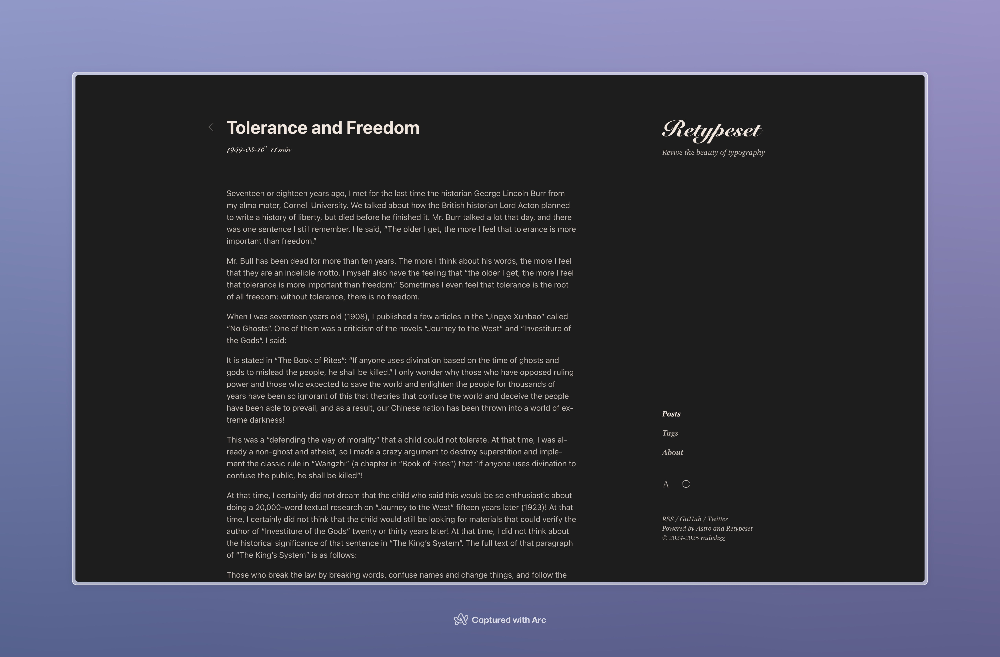

Retypeset は、[OKLCH](https://oklch.com/) カラースペースに基づいてテーマカラーを定義し、デフォルトでは印刷スタイルを模した白黒グレーの配色を採用しています。

個性的なニーズに応えるため、テーマ用にいくつかの配色スキームを作成しました。[src/config.ts](https://github.com/radishzzz/astro-theme-retypeset/blob/master/src/config.ts) でデフォルトの配色を置き換え、**開発サーバーを再起動**して新しい配色をプレビューできます。

## 葱白色




```
light: {
  primary: 'oklch(0.25 0.03 211.86)',
  secondary: 'oklch(0.40 0.03 211.86)',
  background: 'oklch(0.99 0.0039 106.47)',
},
dark: {
  primary: 'oklch(0.92 0.0015 106.47)',
  secondary: 'oklch(0.79 0.0015 106.47)',
  background: 'oklch(0.24 0.0039 106.47)',
},
```

## 烏青




```
light: {
  primary: 'oklch(0.24 0.0172 280.05)',
  secondary: 'oklch(0.40 0.0172 280.05)',
  background: 'oklch(0.98 0.0172 280.05)',
},
dark: {
  primary: 'oklch(0.92 0.0172 280.05)',
  secondary: 'oklch(0.79 0.0172 280.05)',
  background: 'oklch(0.24 0.0172 280.05)',
},
```

## 墨藍




```
light: {
  primary: 'oklch(0.24 0.053 261.24)',
  secondary: 'oklch(0.39 0.053 261.24)',
  background: 'oklch(1 0 0)',
},
dark: {
  primary: 'oklch(0.92 0 0)',
  secondary: 'oklch(0.79 0 0)',
  background: 'oklch(0.24 0.016 265.21)',
},
```

## 米色




```
light: {
  primary: 'oklch(0.25 0 0)',
  secondary: 'oklch(0.41 0 0)',
  background: 'oklch(0.95 0.0237 59.39)',
},
dark: {
  primary: 'oklch(0.93 0.019 59.39)',
  secondary: 'oklch(0.80 0.017 59.39)',
  background: 'oklch(0.23 0 0)',
},
```
