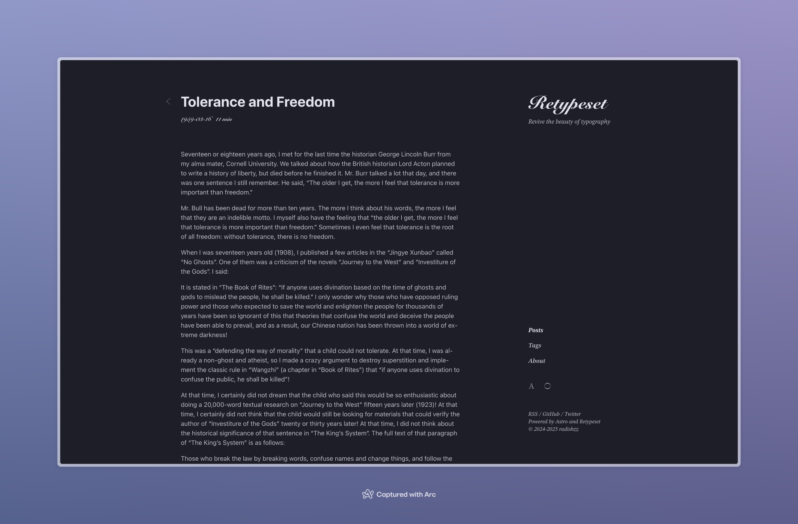
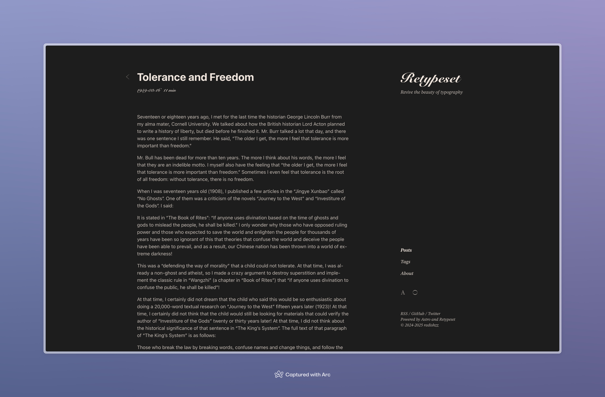

Retypeset 基於 [OKLCH](https://oklch.com/) 顏色空間來定義主題配色，預設為模擬印刷風格的黑白灰配色。

為滿足個性化需求，我為主題製作了一些配色方案。你可以在 [src/config.ts](https://github.com/radishzzz/astro-theme-retypeset/blob/master/src/config.ts) 中替換預設配色，並**重新啟動開發伺服器**以預覽新配色。

## 蔥白


```
light: {
  primary: 'oklch(0.25 0.03 211.86)',
  secondary: 'oklch(0.40 0.03 211.86)',
  background: 'oklch(0.99 0.0039 106.47)',
},
dark: {
  primary: 'oklch(0.92 0.0015 106.47)',
  secondary: 'oklch(0.79 0.0015 106.47)',
  background: 'oklch(0.24 0.0039 106.47)',
},
```

## 鴉青




```
light: {
  primary: 'oklch(0.24 0.0172 280.05)',
  secondary: 'oklch(0.40 0.0172 280.05)',
  background: 'oklch(0.98 0.0172 280.05)',
},
dark: {
  primary: 'oklch(0.92 0.0172 280.05)',
  secondary: 'oklch(0.79 0.0172 280.05)',
  background: 'oklch(0.24 0.0172 280.05)',
},
```

## 墨藍


```
light: {
  primary: 'oklch(0.24 0.053 261.24)',
  secondary: 'oklch(0.39 0.053 261.24)',
  background: 'oklch(1 0 0)',
},
dark: {
  primary: 'oklch(0.92 0 0)',
  secondary: 'oklch(0.79 0 0)',
  background: 'oklch(0.24 0.016 265.21)',
},
```

## 米黃




```
light: {
  primary: 'oklch(0.25 0 0)',
  secondary: 'oklch(0.41 0 0)',
  background: 'oklch(0.95 0.0237 59.39)',
},
dark: {
  primary: 'oklch(0.93 0.019 59.39)',
  secondary: 'oklch(0.80 0.017 59.39)',
  background: 'oklch(0.23 0 0)',
},
```
